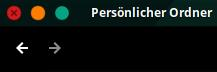

# Flat-Remix-Manjaro-Edition for unite-shell extension
This is an alternative version of the integrated Flat-Remix theme by daniruiz (see [https://github.com/daniruiz/Flat-Remix-GTK](https://github.com/daniruiz/Flat-Remix-GTK) and [https://drasite.com/flat-remix-gtk](https://drasite.com/flat-remix-gtk)) in [unite-shell](https://github.com/hardpixel/unite-shell). 

# Screenshot

## Changes made to original files
* Changed the blue circle to manjaro green 

## Installation
* Replace the flat-remix folder in /usr/share/gnome-shell/extensions/unite@hardpixel.eu/themes/
* Reboot

## License
GPL-3.0 License see LICENSE
